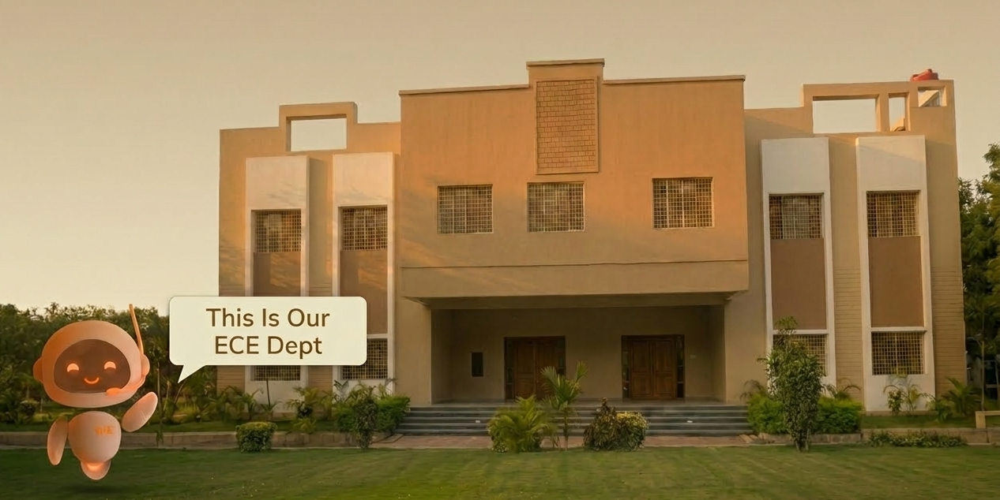
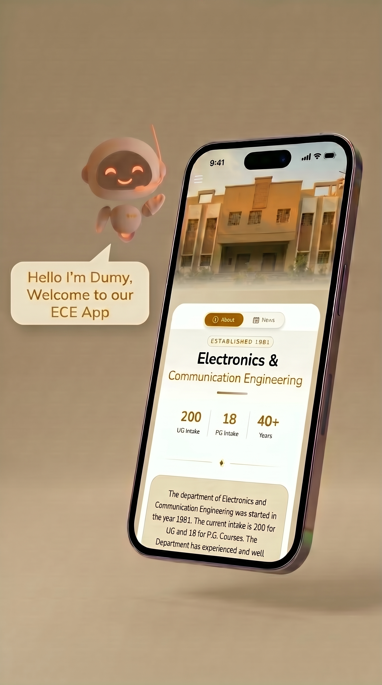
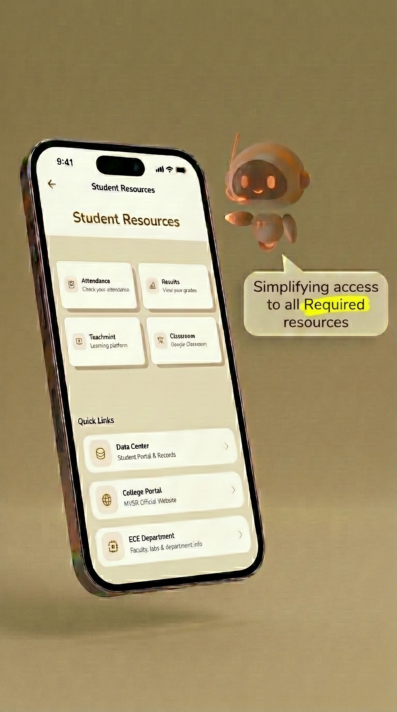
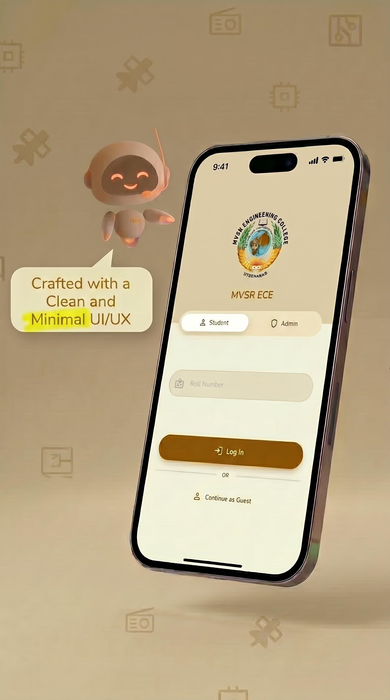

# 📱 MVSR ECE Companion App

**The companion app for the Department of Electronics and Communication Engineering at MVSR Engineering College.** 

*An exclusive, beautiful, and feature-rich app designed by students, for students.*

 

<!-- 📸 HERO SCREENSHOT -->

---

## ✨ Features

- **📅 Timetable & Attendance:** Always know where you need to be with real-time timetable integration.
- **📰 Department News & Announcements:** Never miss an important circular or event update.
- **🏆 Clubs & Activities:** Stay connected with IETE, IEEE, BES, and CSI. 
- **💬 Smart Student Guide Chatbot:** Ask questions and get instant, context-aware answers about the department.
- **💡 Project Ideas & Showcases:** Get inspired by browsing top projects built by your seniors.
- **👥 Faculty & HoD Directory:** Quick access to faculty profiles and contact details.

## 📸 Screenshots

> **Note to Maintainers:** Drag and drop your screenshots right here in the GitHub editor!

| Home Dashboard | Timetable | Chatbot | Profile |
|:---:|:---:|:---:|:---:|
|  |  |  |  |

## 🚀 Getting Started

*This repository serves as the public landing page, issue tracker, and feature request hub. The main application code is maintained privately to protect sensitive endpoints and proprietary configurations.*

**Are you an MVSR ECE student?** 
Download the app from the [Play Store](https://play.google.com/store/apps/details?id=com.mvsr.mvsr_ece) or contact the development team for APK access.

## 🐛 Found a Bug or Have an Idea?

We want to hear from you! If you found a bug or have an idea to make the app even better:

1. Check the [Issues](https://github.com/SukumarPavan/Mvsrece-App-Public/issues) tab to see if it's already been reported.
2. Click **New Issue**.
3. Provide as much detail as possible so we can build it!

## 🌟 Support Us

If you use and love the MVSR ECE App, please consider giving this repository a ⭐ to show your support!

---

Made with passion by ECE Students ❤️

